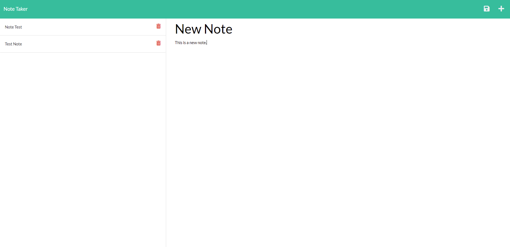

# Challenge Eleven - Note Taker

## Description
The purpose of this project was to create an application that allows users to organize their thoughts and keep track of tasks by writing and saving notes. The application also includes a delete function in case the user wants to delete notes that are no longer needed.

## Screenshot

## Table Of Contents
* [Description](#description)
* [Installation](#installation)
* [Usage](#usage)
* [Contributing](#contributing)
* [Tests](#tests)
* [Credit](#credit)
* [Questions](#questions)
* [License](#license)

## Installation
Please use the following console command to install project dependancies: npm install

## Usage
Please use this project to write and save notes to help you stay organized.

## Link To Deployed Application
https://stormy-meadow-27538.herokuapp.com/

## Contributing
Please email me if you'd like to contribute to this project.

## Tests
There are no tests for this project.

## Credit
Created By: Jeffrey Brittingham  
Creator Github Profile: https://github.com/JBGinger

## Questions
Have any questions about this project? Please send me an email at jeff.brittingham@protonmail.com.
Feel free to take a look at this project's Github repository (along with my other work) on my Github profile: https://github.com/JBGinger.

## License 
  Licensed Under: None  
  License Link: None
  
